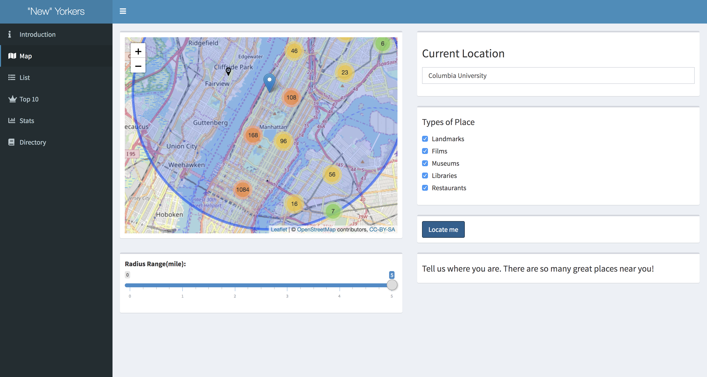

# Project 2: Shiny App Development Version 2.0

### [Project Description](doc/project2_desc.md)



In this second project of GR5243 Applied Data Science, we develop a version 2.0 of an *Exploratory Data Analysis and Visualization* shiny app on a topic of your choice using [NYC Open Data](https://opendata.cityofnewyork.us/) or U.S. government open data released on the [data.gov](https://data.gov/) website. See [Project 2 Description](doc/project2_desc.md) for more details.  

The **learning goals** for this project is:

- business intelligence for data science
- study legacy codes and further development
- data cleaning
- data visualization
- systems development/design life cycle
- shiny app/shiny server

*The above general statement about project 2 can be removed once you are finished with your project. It is optional.

## Project Title Lorem ipsum dolor sit amet
Term: Fall 2019

+ Team #
+ **Projec title**: + Team members
	+ team member 1
	+ team member 2
	+ team member 3
	+ team member 4
	+ team member 5

+ **Project summary**: Lorem ipsum dolor sit amet, consectetur adipiscing elit, sed do eiusmod tempor incididunt ut labore et dolore magna aliqua. Ut enim ad minim veniam, quis nostrud exercitation ullamco laboris nisi ut aliquip ex ea commodo consequat. Duis aute irure dolor in reprehenderit in voluptate velit esse cillum dolore eu fugiat nulla pariatur. Excepteur sint occaecat cupidatat non proident, sunt in culpa qui officia deserunt mollit anim id est laborum.

<<<<<<< HEAD
+ **Contribution statement**: (See [Note on contributions](doc/a_note_on_contributions.md) for more details ) All team members contributed equally in all stages of this project. All team members approve our work presented in this GitHub repository including this contributions statement. 

	+ Data Cleaning
		+ Cleaned and formalized landmarks, filming site, restaurants, libraries, and museum datasets: 
		   yl4062, xy2387, sc4393

	+ UI Design
		+ Created the five-page frame: sc4393, xy2387
		+ Welcome page UI: xy2387, sc4393
		+ Navigation bar and sidebar CSS design: sc4393
		+ Search page choice input, dataTable and map layout: sc4393
	
		
	+ Server - Map Page   :  sc4393
		+ Input selection : cx2225, xz2740
		+ DataTable ouput : cx2225, yl3965
		+ Reset map button: cx2225
		+ Create Map : cx2225, sc4393
		
		
	+ Server - List Page  : sc4393
		
	+ Server - Top 10 Page : sc4393
		
		
	+ Server - Stats Page : yl4062  rq2156
		
		
		
	+ Server - Directory Page : yl4062  rq2156
		
		
	+ Publish: xy2387
		
	
+ **Reference**: We used part of the codes from [group 8 (Spring 2019)](https://github.com/TZstatsADS/Fall2017-project2-grp6) as reference.
=======
+ **Contribution statement**: ([default](doc/a_note_on_contributions.md)) All team members contributed equally in all stages of this project. All team members approve our work presented in this GitHub repository including this contributions statement. 
>>>>>>> a4394aae735820c50e2a809729d8d3baa073cfe4

Following [suggestions](http://nicercode.github.io/blog/2013-04-05-projects/) by [RICH FITZJOHN](http://nicercode.github.io/about/#Team) (@richfitz). This folder is orgarnized as follows.

```
proj/
├── app/
├── lib/
├── data/
├── doc/
└── output/
```

Please see each subfolder for a README file.

